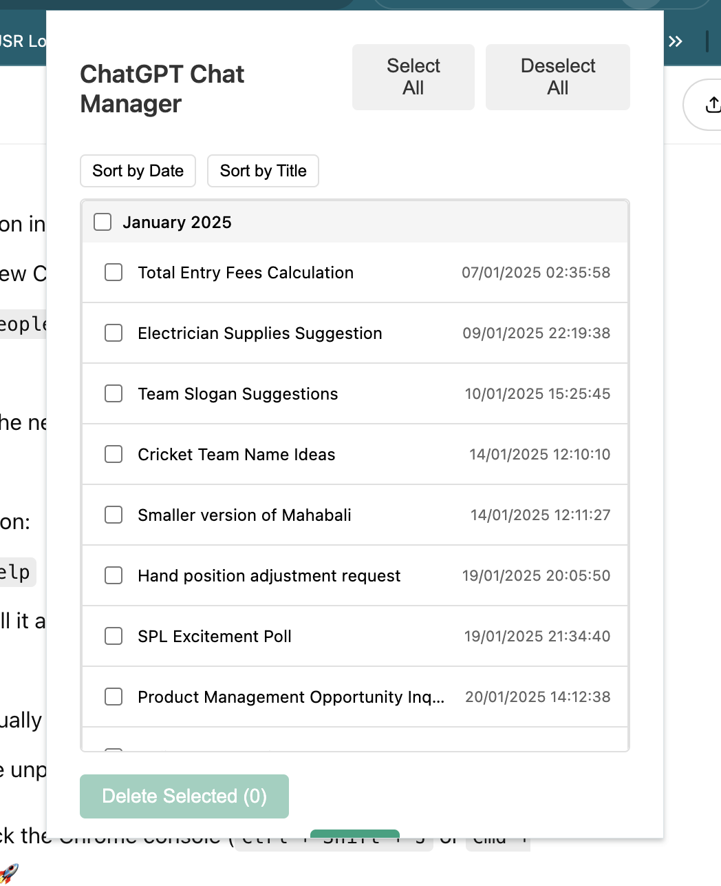

# ChatGPT Chat Manager Chrome Extension

A Chrome extension that helps you efficiently manage your ChatGPT conversations. Easily view, organize, and bulk delete your chat history with a clean, user-friendly interface.

## 🤖 AI-Generated Code

This project was entirely generated using AI (Claude 3.5 Sonnet) through pair programming. The AI assistant helped in:
- Designing the architecture
- Writing all the code components
- Creating the documentation
- Implementing best practices
- Handling edge cases and error scenarios

While the code is AI-generated, it has been thoroughly tested and follows modern development standards. This project serves as an example of how AI can be used to create practical, production-ready software.

 <!-- You'll need to add screenshots later -->

## Features

- 🗂️ **Month-wise Organization**: Conversations are automatically grouped by month for better organization
- 🔄 **Smart Sorting**: Sort conversations by date or title
- ✨ **Modern UI**: Clean and intuitive interface with smooth animations
- ⚡ **Bulk Actions**: Select and delete multiple conversations at once
- 📱 **Responsive Design**: Works well on different screen sizes
- 🔒 **Secure**: Uses your existing ChatGPT authentication, no additional login required

## Installation

### From Chrome Web Store
*(Coming soon)*

### Manual Installation (Developer Mode)
1. Download or clone this repository
2. Open Chrome and navigate to `chrome://extensions/`
3. Enable "Developer mode" in the top right corner
4. Click "Load unpacked" and select the directory containing the extension files

## Usage

1. Click the extension icon in your Chrome toolbar
2. Browse your conversations organized by month
3. Use the sort buttons to organize by date or title
4. Select individual conversations or entire months using checkboxes
5. Click "Delete Selected" to remove chosen conversations
6. Use the collapse/expand feature to focus on specific time periods

## Features in Detail

### Month-wise Organization
- Conversations are automatically grouped by month
- Each month section can be collapsed/expanded
- Quick select/deselect all conversations in a month

### Sorting Options
- Sort by Date (toggle ascending/descending)
- Sort by Title (alphabetical order)
- Persistent sorting preferences

### Selection Controls
- Select/Deselect All button for global control
- Month-level checkboxes for group selection
- Individual conversation selection
- Visual feedback for partial selections

## Technical Details

The extension integrates with ChatGPT's backend API and requires the following permissions:
- Access to `chatgpt.com` for API communication
- Storage permission for saving preferences
- Cookies permission for authentication

## Privacy & Security

- No data is stored on external servers
- Uses your existing ChatGPT session
- No additional authentication required
- All operations are performed locally

## Development

### Project Structure
```
chrome_extension/
├── manifest.json      # Extension configuration
├── popup.html        # Main UI
├── popup.js          # UI logic
├── background.js     # Background processes
├── content.js        # Page integration
└── icons/           # Extension icons
```

### Building from Source
1. Clone the repository
2. Make any desired modifications
3. Load the extension in Chrome using Developer mode

## Contributing

Contributions are welcome! Please feel free to submit a Pull Request.

## License

This project is licensed under the MIT License - see the [LICENSE](LICENSE) file for details.

## Support

If you encounter any issues or have suggestions:
1. Check the [Issues](https://github.com/yourusername/chatgpt-chat-manager/issues) page
2. Create a new issue if your problem isn't already listed
3. Provide detailed information about the problem

## Acknowledgments

- Built for the ChatGPT community
- Inspired by the need for better conversation management
- Uses ChatGPT's official API endpoints

---

Made with ❤️ for the ChatGPT community 